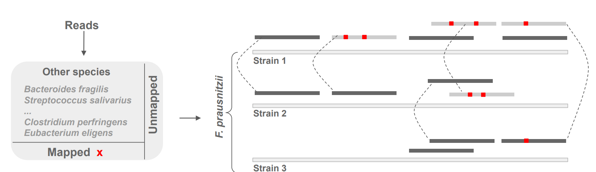

# Strain profiling pipeline for the human gut metagenome

## Overview

This pipeline could estimate coverages,depths and abudances of strains rather than species in metagenomic samples.

To use this pipeline, you should first confirm which species you want to focus on to estimate strains profile of it. To find a candidate species, a SNP analysis could be performed first. Check [Our metagenomic SNP calling pipeline](https://github.com/labomics/metagenomic_SNP_calling).

Reference genomes should be prepared, including both the target strains and other strains presenting in a metagenomic sample.

You could also generate sythetic data to check the performance of this pipeline.

## Pipeline

## Citation

Currently this work is under review for publication in **mSystems**.

> ### Comprehensive Strain-level Analysis of the Gut Microbe *Faecalibacterium Prausnitzii* in Patients with Liver Cirrhosis
> Yaowen Chena\*, Pu Liua\*, Runyan Liua, Shuofeng Hua, Zhen Hea, Guohua Donga, Chao Fenga, Sijing Ana, Xiaomin Yinga#

> a Center for Computational Biology, Beijing Institute of Basic Medical Sciences, Beijing 100850, China

## Requirements

 - Bowtie2
 - Samtools

## Usage

For  synthetic data, `synthetic.py` could be used to test the pipeline.

    usage: synthetic.py [-h] [--bowtie BOWTIE] [--samtools SAMTOOLS]
                    [--background_ref_fna_path BACKGROUND_REF_FNA_PATH]
                    [--background_ref_db_path BACKGROUND_REF_DB_PATH]
                    [--target_ref_fna_path TARGET_REF_FNA_PATH]
                    [--target_ref_db_path TARGET_REF_DB_PATH]
                    [--target_ref_separate_db_path TARGET_REF_SEPARATE_DB_PATH]
                    [--background_max_num BACKGROUND_MAX_NUM]
                    [--background_min_num BACKGROUND_MIN_NUM]
                    [--target_max_num TARGET_MAX_NUM]
                    [--target_min_num TARGET_MIN_NUM] [--data_dir DATA_DIR]
                    [--output_dir OUTPUT_DIR] [--threads THREADS]

    optional arguments:
      -h, --help            show this help message and exit
      --bowtie BOWTIE       The bowtie2 bin path
      --samtools SAMTOOLS   The samtools bin path
      --background_ref_fna_path BACKGROUND_REF_FNA_PATH
                        The path of background genome references
      --background_ref_db_path BACKGROUND_REF_DB_PATH
                        The path of background genome references
      --target_ref_fna_path TARGET_REF_FNA_PATH
                        The path of target genome references
      --target_ref_db_path TARGET_REF_DB_PATH
                        The path of target genome references
      --target_ref_separate_db_path TARGET_REF_SEPARATE_DB_PATH
                        References built from specific target strains
      --background_max_num BACKGROUND_MAX_NUM
                        Upper limit for random background genomes selection
      --background_min_num BACKGROUND_MIN_NUM
                        Lower limit for random background genomes selection
      --target_max_num TARGET_MAX_NUM
                        Upper limit for random target genomes selection
      --target_min_num TARGET_MIN_NUM
                        Lower limit for random target genomes selection
      --data_dir DATA_DIR   Dir for generated data files
      --output_dir OUTPUT_DIR
                        Output dir for results files
      --threads THREADS     Threads number for multiprocessing

To profile the strains in samples, please use `profiling.py`.

    usage: profiling.py [-h] [--bowtie BOWTIE] [--samtools SAMTOOLS] [--fq1 FQ1]
                    [--outbase OUTBASE] [--ref_fna_dir REF_FNA_DIR]
                    [--ref_db_all REF_DB_ALL]
                    [--ref_db_separate_path REF_DB_SEPARATE_PATH]
                    [--threads THREADS]

    optional arguments:
      -h, --help            show this help message and exit
      --bowtie BOWTIE       The bowtie2 bin path
      --samtools SAMTOOLS   The samtools bin path
      --fq1 FQ1             The input fastq read1 file
      --outbase OUTBASE     The output dir
      --ref_fna_dir REF_FNA_DIR
                        References location
      --ref_db_all REF_DB_ALL
                        References built from all strains
      --ref_db_separate_path REF_DB_SEPARATE_PATH
                        References built from specific strains
      --threads THREADS     Threads number for multiprocessing

## Test

To test if the pipeline works, please run the `test.sh`.

    sh test.sh

## Guide

The following describes how to use this pipeline to estimate the strain diversity in a sample. It should be noted that before running the pipeline, we must know what the target microbe species is, just like the *Faecalibacterium Prausnitzii* mentioned in our article. At the same time, we need to know the other microbes in the sample besides the target microbe, which we call background microbes. You can use [`MetaPhlAn2`](https://github.com/biobakery/MetaPhlAn2) to determine the background microbes. In addition, you can perform SNP analysis ([check our SNP analysis pipeline](https://github.com/labomics/metagenomic_SNP_calling)) to find microbes that may have strain heterogeneity in different conditions. 

After determining the target species, we need to download all strain genomes under its species and store them in `fna` format. In addition, we need to use `Bowtie2` to build indexes of these genomes. On the one hand, merge all the files into a     `merged.fna`, and then perform index building. On the other hand, separately indexing each strain  for subsequent use.

Here we still choose *F. Prausnitzii* as the target microbe, but considering the large number of strains, we only selected 3 strains for example, which can be viewed under the directory `test/refs/targets/`. We have already performed `Bowtie2` index construction on these strains, including separate and merged indexes, as just mentioned. Similarly, for the background species, we only randomly select 5 genomes, which can be viewed under `test/refs/backgrounds/`. It should be noted that the background genome only needs to be merged to construct the index, and there is no need to construct it separately.

Below shows the directory tree of reference genomes.

    refs
    |-- backgrounds
    |   |-- fnas
    |   |   |-- GCA_000185685.2_Ente_bact_9_2_54FAA_V2_genomic.fna
    |   |   |-- GCA_000225685.1_Erys_bact_2_2_44A_V1_genomic.fna
    |   |   |-- GCA_000260695.1_SparasanguinisF0449v1.0_genomic.fna
    |   |   |-- GCA_000390965.1_Ente_faec_B1327_V1_genomic.fna
    |   |   `-- GCA_000474695.1_Lactobacillus_plantarum_WJL_genome_Assembly_genomic.fna
    |   |-- merged.1.bt2
    |   |-- merged.2.bt2
    |   |-- merged.3.bt2
    |   |-- merged.4.bt2
    |   |-- merged.fna
    |   |-- merged.rev.1.bt2
    |   `-- merged.rev.2.bt2
    `-- targets
        |-- fnas
        |   |-- GCA_000166035.1_ASM16603v1_genomic.fna
        |   |-- GCA_001406615.2_14207_7_53-2_genomic.fna
        |   `-- GCA_902388275.1_UHGG_MGYG-HGUT-02545_genomic.fna
        |-- merged.1.bt2
        |-- merged.2.bt2
        |-- merged.3.bt2
        |-- merged.4.bt2
        |-- merged.fna
        |-- merged.rev.1.bt2
        |-- merged.rev.2.bt2
        `-- separate_dbs
            |-- GCA_000166035.1_ASM16603v1_genomic.1.bt2
            |-- GCA_000166035.1_ASM16603v1_genomic.2.bt2
            |-- GCA_000166035.1_ASM16603v1_genomic.3.bt2
            |-- GCA_000166035.1_ASM16603v1_genomic.4.bt2
            |-- GCA_000166035.1_ASM16603v1_genomic.rev.1.bt2
            |-- GCA_000166035.1_ASM16603v1_genomic.rev.2.bt2
            |-- GCA_001406615.2_14207_7_53-2_genomic.1.bt2
            |-- GCA_001406615.2_14207_7_53-2_genomic.2.bt2
            |-- GCA_001406615.2_14207_7_53-2_genomic.3.bt2
            |-- GCA_001406615.2_14207_7_53-2_genomic.4.bt2
            |-- GCA_001406615.2_14207_7_53-2_genomic.rev.1.bt2
            |-- GCA_001406615.2_14207_7_53-2_genomic.rev.2.bt2
            |-- GCA_902388275.1_UHGG_MGYG-HGUT-02545_genomic.1.bt2
            |-- GCA_902388275.1_UHGG_MGYG-HGUT-02545_genomic.2.bt2
            |-- GCA_902388275.1_UHGG_MGYG-HGUT-02545_genomic.3.bt2
            |-- GCA_902388275.1_UHGG_MGYG-HGUT-02545_genomic.4.bt2
            |-- GCA_902388275.1_UHGG_MGYG-HGUT-02545_genomic.rev.1.bt2
            `-- GCA_902388275.1_UHGG_MGYG-HGUT-02545_genomic.rev.2.bt2

Next, we explain the key parameters required to analysis the simulation data to illustrate the use of this pipeline. When running `synthetic.py`, the parameter `--background_ref_fna_path` specifies the location of the `fna` files of the background genomes. The parameter `--background_ref_db_path` specifies the index path of the background. The parameter `--target_ref_fna_path` specifies the location of the genome `fna` files of the target strains; the parameter `target_ref_db_path` specifies the location of the bowtie2 index of the merged  target strains; the parameter `--target_ref_separate_db_path` specifies the location of the individual bowtie2 indexes of the genomes of the target strains.

When generating data, we need to randomly determine the number of target strains and background microbes. The parameter `--background_max_num` specifies the maximum number of background genomes, and `--background_min_num` specifies the minimum number of background genomes. Similarly, `--target_max_num` specifies the maximum number of target strains, and `--target_min_num` specifies the minimum number of target strains. Parameters `--data_dir` and `--output_dir` respectively specify the location of generated data files and results files.

After specifying the above parameters, we can run the test script. If there is no error , we will get the final output result in the `test/output/res` folder under the specified directory. It includes the actual coverages, depths, and estimated coverages and depths for each strain in the sample. Below shows the content of a result file. Column `best_mean_nm` shows the mismatch number per 100 bp sequences. 

| name | real_cov | real_dep | frac | rank | predicted_cov | predicted_dep |  best_mean_nm | 
|--|--|--|--|--|--|--|--|
|GCA_001406615.2_14207_7_53-2_genomic|0.19794745682505036|27.536506003369926|0.3548387096774194|0|0.1961683557523552|27.516514338921198|0.011224284211233239|
|GCA_902388275.1_UHGG_MGYG-HGUT-02545_genomic|0.0|0.0|0.0|2|0.0105163|0.207771|0.05146059782608696|
|GCA_000166035.1_ASM16603v1_genomic|0.0|0.0|0.0|1|0.06950342274989124|3.765247926466788|0.011102977061981455

In addition, the results of the read re-assignment will be generated in `test/outputs/stats` directory. The `best` column represents the number of reads assigned to the corresponding strain, which can be used to calculate the relative abundance of it. Below shows the directory tree of the outputs. Temp outputs files have been deleted to save the space.
    
    test/outputs/
    |-- coverage
    |-- info
    |   `-- cfd87a7b-1e95-4c5c-8f0b-2776bfb7ffe3.info
    |-- output_overall
    |-- output_sep
    |-- res
    |   `-- cfd87a7b-1e95-4c5c-8f0b-2776bfb7ffe3.csv
    |-- stats
    |   |-- best_number.cfd87a7b-1e95-4c5c-8f0b-2776bfb7ffe3.txt
    |   `-- stat.cfd87a7b-1e95-4c5c-8f0b-2776bfb7ffe3.csv
    `-- tmp

In the `info` directory, the files records the specific composition of the synthesized sample, including the numbers and proportions of target and background genomes, as shown in the following table.

|Genome|Abundance|Type|
|--|--|--|
|GCA_001406615.2_14207_7_53-2_genomic|11|target|
|GCA_000225685.1_Erys_bact_2_2_44A_V1_genomic|4|background|
|GCA_000185685.2_Ente_bact_9_2_54FAA_V2_genomic|4|background|
|GCA_000474695.1_Lactobacillus_plantarum_WJL_genome_Assembly_genomic|11|background|
|GCA_000390965.1_Ente_faec_B1327_V1_genomic|1|background|

If you don't want to use simulation data, but directly estimate the strain diversity in existing samples, you can run the `profiling.py` script directly. You only need to provide the location of the real data and the corresponding reference genome path. 

However, we recommend filtering the original data first to remove the reads that can be mapped to the background genomes. You can run `mapping_filtering.py` to perform this operation. The usage is as follows:

    usage: mapping_filter.py [-h] [--bowtie BOWTIE] [--data_path DATA_PATH]
                         [--output_path OUTPUT_PATH]
                         [--background_ref_db_all BACKGROUND_REF_DB_ALL]

    optional arguments:
      -h, --help            show this help message and exit
      --bowtie BOWTIE       The bowtie2 bin path
      --data_path DATA_PATH
                        The fastq data path
      --output_path OUTPUT_PATH
                        The output path
      --background_ref_db_all BACKGROUND_REF_DB_ALL
                        References built from all background genomes

